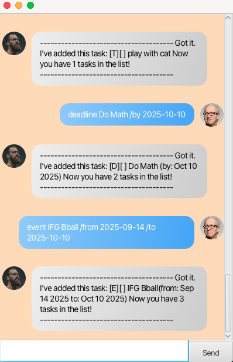

# Itachi User Guide

<!--// Product screenshot goes here-->



<!-- Product intro goes here -->
Itachi is a personal task management chatbot designed to
help you keep track of your tasks efficiently. You can list, add, 
delete, mark tasks as done and unmark tasks using simple text commands. 
Itachi supports multiple types of tasks, including ToDos, 
Deadlines, and Events.

## Adding deadlines

<!-- // Describe the action and its outcome. -->
You can add a deadline task with the `deadline` keyword
followed by the task description and a `/by` clause.

<!-- // Give examples of usage -->
### Format
`deadline <description> /by <date>`

Example: `deadline Submit assignment /by 2025-09-20 `

Expected output:

```
--------------------------------------
Got it. I've added this task:
[D][ ] Submit assignment (by: Sep 20 2025)
Now you have 1 tasks in the list!
--------------------------------------

```


## Adding events

You can add an event task with the `event` keyword
followed by the task description, a `/from` clause and a `/to` clause.

### Format
`event <description> /from <date> /to <date>`

Example: `event Team meeting /from 2025-10-10 /to 2025-11-10`

Expected output:
```
--------------------------------------
Got it. I've added this task:
[E][ ] Team meeting(from: Oct 10 2025 to: Nov 10 2025)
Now you have 1 tasks in the list!
--------------------------------------
```


## Adding toDos

You can add a todo task with the `todo` keyword followed 
by the task description.

### Format
`todo <description>`

Example: `todo Read a book`

Expected output:
```
--------------------------------------
Got it. I've added this task:
[T][ ] Read a book
Now you have 1 tasks in the list!
--------------------------------------
```


## Listing tasks

You can see all the tasks 
currently in your list with the `list` command.

### Format
`list`

Example: `list`

Expected output:
```
--------------------------------------
Here are the tasks in your list:
1. [T][ ] Read a book
2. [E][ ] Team meeting(from: Oct 10 2025 to: Nov 10 2025)
3. [D][ ] Submit assignment (by: Sep 20 2025)
```

## Marking a task as done

You can mark a task as 
completed using the `mark` command with the task number.

### Format
`mark <task_number>`

Example: `mark 2`

Expected output:
```
--------------------------------------
Nice! I've marked this task as done:
[E][X] Team meeting(from: Oct 10 2025 to: Nov 10 2025)
--------------------------------------
```


## Unmarking a task

You can unmark a previously completed task
using the `unmark` command with the task number.

### Format
`unmark <task_number>`

Example: `unmark 2`

Expected output:
```
--------------------------------------
Nice! I've marked this task as NOT done:
[E][ ] Team meeting(from: Oct 10 2025 to: Nov 10 2025)
--------------------------------------
```

## Deleting a task

You can delete a task with 
the `delete` command followed by the task number.

### Format
`delete <task_number>`

Example: `delete 2`

Expected output:
```
Task 2 deleted
```

## Exiting the program

You can exit the program with the `bye` command

### Format
`bye`

Example: `bye`

Expected output:
```
--------------------------------------
byeee see u in the leaf village again!
--------------------------------------
```
